<p align="center">
  
</p>
<h3 align="center">Hello, Welcome to My GitHub</h3>
<h1 align="center">Hemanth Jaya Raghava Mandapati</h1>

<p align="center">
  <b>BCA Data Science Student | Python | Data Analytics | AI/ML</b>
</p>

<p align="center">
  Learning with Purpose • Building with Responsibility • Growing Every Day
</p>

---

## 👨‍💻 About Me

I am a BCA Data Science student from Kakinada, Andhra Pradesh, with a
strong interest in programming, data analytics, data science and
emerging technologies.

I enjoy learning through practical projects, solving programming
problems and exploring how data can be transformed into meaningful
insights and real-world solutions.

- 🎓 Pursuing **BCA in Data Science**
- 📍 Kakinada, Andhra Pradesh, India
- 💻 Interested in **Python, Data Science and Data Analytics**
- 🤖 Exploring **Artificial Intelligence and Machine Learning**
- 📊 Interested in **data analysis and visualization**
- 🌐 Exploring **Web Development**
- 🧠 Practicing programming and problem solving
- 🌱 Continuously learning new technologies
- 🚀 Interested in developing practical, real-world solutions

---

## 🛠️ Technical Skills

### 💻 Programming Languages

<p>


</p>

### 📊 Data Science & Analytics

<p>


</p>

- Data Cleaning
- Exploratory Data Analysis
- Data Visualization
- Statistical Analysis
- Data Processing

### 🤖 AI & Machine Learning

<p>

</p>

- Machine Learning Fundamentals
- Natural Language Processing
- Sentiment Analysis
- TF-IDF
- Classification
- AI/ML Fundamentals

### 🌐 Web Technologies

<p>


</p>

### 🔧 Tools & Platforms

<p>


</p>

---

## 🚀 Featured Projects

### 🌱 Green@Energy

**Smart Tree Monitoring and Sustainable Energy Harvesting System**

A green-technology project combining smart tree monitoring, IoT
sensors, AI-based monitoring and sustainable energy harvesting concepts.

**Focus:**

`Green Technology` `IoT` `AI` `Data Monitoring` `Sustainable Energy`

---

### 🧠 NLP Sentiment Analysis

A Natural Language Processing project that analyzes text sentiment
using TF-IDF and machine-learning techniques.

**Technologies:**

`Python` `Pandas` `Scikit-learn` `TF-IDF` `Machine Learning`

---

### 🛣️ Road Safety System

A technology-based project concept focused on improving road safety
through automated monitoring and computer-vision approaches.

**Technologies & Concepts:**

`Python` `OpenCV` `Computer Vision` `Road Safety`

---

## 🏆 Achievements

- 🥇 **First Prize — Coding Contest 2K25**
- 🥇 **First Prize — Coding Contest**
- 💻 Participated in Python programming and debugging contests
- 🧠 Regularly practicing programming and problem solving
- 📊 Developed practical Data Science and analytics projects
- 🎤 Selected for presentation at **Andhra Vijnana Sammelan 2026**
- 🌱 Developed and presented the **Green@Energy** project concept

---

## 📜 Certifications & Learning

- 🐍 Cisco Python Certification
- 💻 Cisco C Programming Certification
- 📊 Deloitte Data Analytics Job Simulation
- 📊 Tata Data Analytics Job Simulation
- 📚 Coursera Certification
- 🧑‍💻 HackerRank Programming
- 🐍 NPTEL — Python for Data Science

---

## 📚 Currently Learning

```text
Python
   │
   ▼
Data Analytics
   │
   ▼
Data Science
   │
   ▼
Machine Learning
   │
   ▼
Artificial Intelligence
